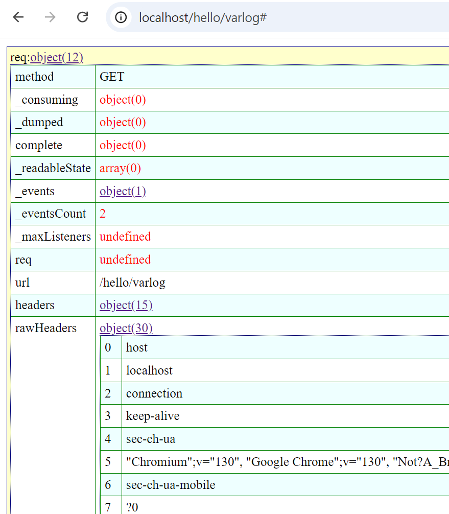

# varlog


Dump and inspect complex JavaScript variables through an interactive drill-down interface, especially valuable for debugging Node.js applications. The interface allows you to:

* Explore nested objects and arrays
* Inspect complex data structures
* View detailed property information
* Navigate through multiple levels of object hierarchy

Perfect for debugging server-side code and inspecting large data structures in Node.js environments.

## Installation

```sh
$ npm install varlog
```

## Sample code
```js
const http = require('http');
var varlog = require("varlog");

const server = http.createServer((req, res) => {
	res.statusCode = 200;
	res.setHeader('Content-Type', 'text/html');
	res.end(
		varlog.css+
		varlog.dump('req',req,2)+//2 refers to depth, default is 3
		varlog.dump('res',res)
	);
});

server.listen(80, 'localhost', () => {
  console.log(`Server running`);
});
```
## Screenshot
